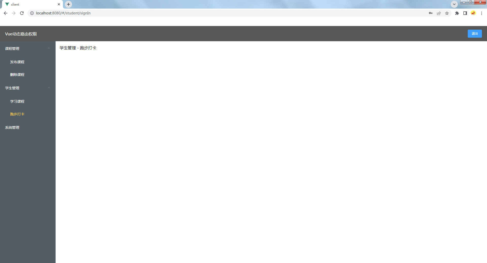

# Vue动态路由、权限控制

这是一个vue的动态路由权限示例项目，包含了一个vue+Element项目，一个简易的node服务，用于支撑路由鉴权。

## 1 效果展示


## 2 项目思路
Node服务：
- 提供了一个登录接口，登录成功之后，返回给前端一个token，前端存储token，用于后期请求用户信息。
- 提供了一个获取用户信息的接口，根据token，来解析出当前用户的权限，返回给前端。

vue项目：
- 登录成功之后，拿到返回的token，存储到vuex和sessionStorage当中，随后跳转 /layout 路由
- 跳转路由之后，会进入路由的钩子函数当中，在钩子函数当中，进行一系列判断，是否登录、是否跳转login页面等，核心为请求接口，获取用户权限，根据权限生成当前用户的路由，再使用router.addRoutes添加到路由表当中。
- 路由分为了asyncRoutes和constantRoutes，分别为动态路由和静态路由，静态路由初始就会挂载，动态路由则是获取到用户权限之后，筛选完成之后才会通过router.addRoutes挂载到路由当中。
- 关于菜单：这个项目当中基于elementUI的Menu组件封装了一个无限递归层级的菜单组件，当动态路由被筛选完成之后，菜单组件会基于这个筛选过的路由，生成一份菜单，无需自己再手动添加菜单。

## 3 项目目录说明

- `client`：vue项目
- `server`：Node服务

## 4 项目运行
```js
// 安装vue项目依赖和启动项目
cd client
npm install
npm run serve

// 安装node服务依赖和启动项目
cd server
npm install
node app.js
```